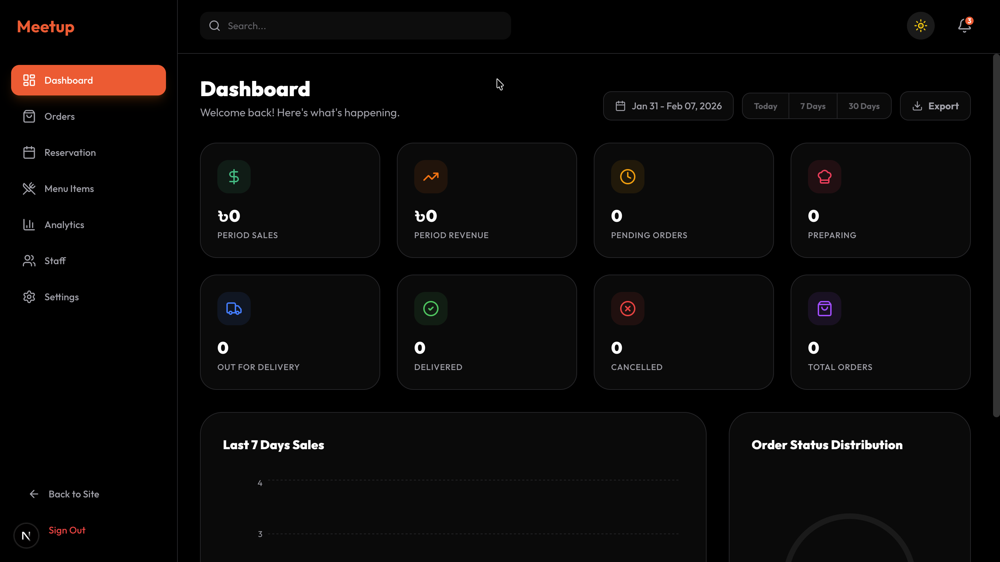

# Meetup - Premium Restaurant & Food Delivery System

[](https://nextjs.org/)
[](https://tailwindcss.com/)
[](https://supabase.com/)
[](https://www.framer.com/motion/)

**Meetup** is a sophisticated, full-stack restaurant management and food delivery platform. Designed with a focus on premium aesthetics and seamless user experience, it offers everything from a high-conversion landing page to a powerful administrative dashboard for order fulfillment and analytics.

---

## 🚀 Live Preview
[View Live Demo](https://meetup-restaurant.vercel.app)

---

## ✨ Features

### 🍽️ Customer Experience
- **Immersive Landing Page**: Hero section with GSAP/Framer Motion animations that WOW users at first glance.
- **Interactive Menu**: Smooth categorized browsing with real-time cart management.
- **Smart Order Tracking**: Beautiful timeline visualization for tracking meal preparation and delivery status.
- **Dual Theme Support**: Elegant dark and light modes tailored for any environment.

### 🔐 Administrative Hub
- **Executive Dashboard**: Comprehensive analytics with multi-period sales and revenue charts.
- **Order Management**: Robust system to handle incoming orders, prepare meals, and verify deliveries via OTP.
- **Inventory & Menu Control**: Easy-to-use interface for managing food items and staff.
- **Secure Authentication**: Dedicated admin gateway for authorized access.

---

## 🔑 Admin Access (Demo)
- **URL**: `/admin`
- **Email**: `meetupofficial@gmail.com`
- **Password**: `meetup1234`

---

## 📸 Screenshots

| Home Page (Dark) | Signature Foods (Light) |
| :---: | :---: |
|  |  |

| Admin Dashboard | Order Management |
| :---: | :---: |
|  |  |

| Order Tracking |
| :---: |
|  |

> **Note**: To ensure these images appear, please save your screenshots as `home.png`, `menu.png`, `dashboard.png`, `orders.png`, and `tracking.png` inside the `./public/screenshots/` directory.

---

## 🛠️ Tech Stack

- **Core**: Next.js 15 (App Router), TypeScript
- **Backend/DB**: Supabase (PostgreSQL)
- **Styling**: Tailwind CSS 4, Lucide Icons
- **Motion**: Framer Motion, GSAP
- **Data Viz**: Recharts
- **Font**: Outfit & Inter (Google Fonts)

---

## 🛠️ Installation & Setup

1. **Clone the repository:**
   ```bash
   git clone https://github.com/sahidDev09/meetup-restaurant.git
   cd meetup-restaurant
   ```

2. **Install dependencies:**
   ```bash
   npm install
   ```

3. **Configure Environment Variables:**
   Create a `.env.local` file and add your Supabase credentials:
   ```env
   NEXT_PUBLIC_SUPABASE_URL=your_supabase_url
   NEXT_PUBLIC_SUPABASE_ANON_KEY=your_supabase_anon_key
   ```

4. **Initialize Database:**
   Apply the provided `supabase_schema.sql` in your Supabase SQL Editor to set up the necessary tables.

5. **Run the development server:**
   ```bash
   npm run dev
   ```

---

## 📄 License
Distributed under the MIT License. See `LICENSE` for more information.

---

Developed with ❤️ by [Sahid](https://github.com/sahidDev09)
